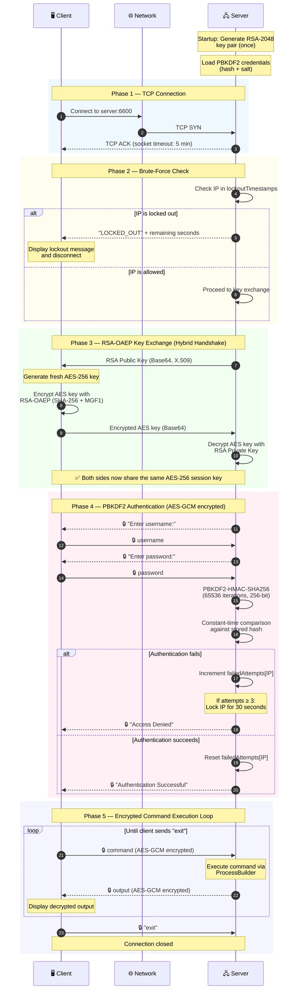

# Secure Remote Access Tool — Architecture

## Connection & Communication Flow

```mermaid
sequenceDiagram
    autonumber
    participant C as 🖥️ Client
    participant N as 🌐 Network
    participant S as 🖧 Server

    Note over S: Startup: Generate RSA-2048<br/>key pair (once)
    Note over S: Load PBKDF2 credentials<br/>(hash + salt)

    rect rgb(240, 248, 255)
        Note over C, S: Phase 1 — TCP Connection
        C->>N: Connect to server:6600
        N->>S: TCP SYN
        S-->>C: TCP ACK (socket timeout: 5 min)
    end

    rect rgb(255, 253, 240)
        Note over C, S: Phase 2 — Brute-Force Check
        S->>S: Check IP in lockoutTimestamps
        alt IP is locked out
            S-->>C: "LOCKED_OUT" + remaining seconds
            Note over C: Display lockout message<br/>and disconnect
        else IP is allowed
            S->>S: Proceed to key exchange
        end
    end

    rect rgb(240, 255, 240)
        Note over C, S: Phase 3 — RSA-OAEP Key Exchange (Hybrid Handshake)
        S->>C: RSA Public Key (Base64, X.509)
        Note over C: Generate fresh AES-256 key
        C->>C: Encrypt AES key with<br/>RSA-OAEP (SHA-256 + MGF1)
        C->>S: Encrypted AES key (Base64)
        S->>S: Decrypt AES key with<br/>RSA Private Key
        Note over C, S: ✅ Both sides now share the same AES-256 session key
    end

    rect rgb(255, 240, 245)
        Note over C, S: Phase 4 — PBKDF2 Authentication (AES-GCM encrypted)
        S-->>C: 🔒 "Enter username:"
        C->>S: 🔒 username
        S-->>C: 🔒 "Enter password:"
        C->>S: 🔒 password
        S->>S: PBKDF2-HMAC-SHA256<br/>(65536 iterations, 256-bit)
        S->>S: Constant-time comparison<br/>against stored hash
        alt Authentication fails
            S->>S: Increment failedAttempts[IP]
            Note over S: If attempts ≥ 3:<br/>Lock IP for 30 seconds
            S-->>C: 🔒 "Access Denied"
        else Authentication succeeds
            S->>S: Reset failedAttempts[IP]
            S-->>C: 🔒 "Authentication Successful"
        end
    end

    rect rgb(245, 245, 255)
        Note over C, S: Phase 5 — Encrypted Command Execution Loop
        loop Until client sends "exit"
            C->>S: 🔒 command (AES-GCM encrypted)
            Note over S: Execute command via<br/>ProcessBuilder
            S-->>C: 🔒 output (AES-GCM encrypted)
            Note over C: Display decrypted output
        end
        C->>S: 🔒 "exit"
        Note over C, S: Connection closed
    end
```

---

## Cryptographic Architecture Overview

```mermaid
graph TB
    subgraph CRYPTO["🔐 Cryptographic Architecture"]
        direction TB

        subgraph AES["AES-256-GCM (Symmetric)"]
            A1["Algorithm: AES/GCM/NoPadding"]
            A2["Key Size: 256-bit"]
            A3["IV: 12 bytes (random per message)"]
            A4["Auth Tag: 128-bit"]
            A5["Wire Format: Base64(IV ∥ ciphertext ∥ tag)"]
            A1 --- A2 --- A3 --- A4 --- A5
        end

        subgraph RSA["RSA-2048-OAEP (Asymmetric)"]
            R1["Algorithm: RSA/ECB/OAEPWithSHA-256AndMGF1Padding"]
            R2["Key Size: 2048-bit"]
            R3["Purpose: Secure AES key exchange"]
            R4["Padding: OAEP (prevents Bleichenbacher attack)"]
            R1 --- R2 --- R3 --- R4
        end

        subgraph PBKDF2["PBKDF2 (Password Hashing)"]
            P1["Algorithm: PBKDF2WithHmacSHA256"]
            P2["Iterations: 65,536"]
            P3["Output: 256-bit hash"]
            P4["Salt: 128-bit (unique per user)"]
            P5["Comparison: Constant-time XOR"]
            P1 --- P2 --- P3 --- P4 --- P5
        end

        subgraph BRUTE["🛡️ Brute-Force Protection"]
            B1["Max Attempts: 3 per IP"]
            B2["Lockout Duration: 30 seconds"]
            B3["Storage: ConcurrentHashMap"]
            B1 --- B2 --- B3
        end
    end

    subgraph FLOW["📡 Data Flow"]
        direction LR
        F1["Server generates<br/>RSA key pair"] --> F2["Client receives<br/>RSA public key"]
        F2 --> F3["Client generates<br/>AES-256 key"]
        F3 --> F4["Client encrypts AES key<br/>with RSA-OAEP"]
        F4 --> F5["Server decrypts with<br/>RSA private key"]
        F5 --> F6["All further messages<br/>encrypted with AES-GCM"]
    end

    RSA -->|"Secures"| FLOW
    AES -->|"Encrypts all traffic"| FLOW
    PBKDF2 -->|"Authenticates user"| FLOW
    BRUTE -->|"Rate-limits login"| FLOW
```
